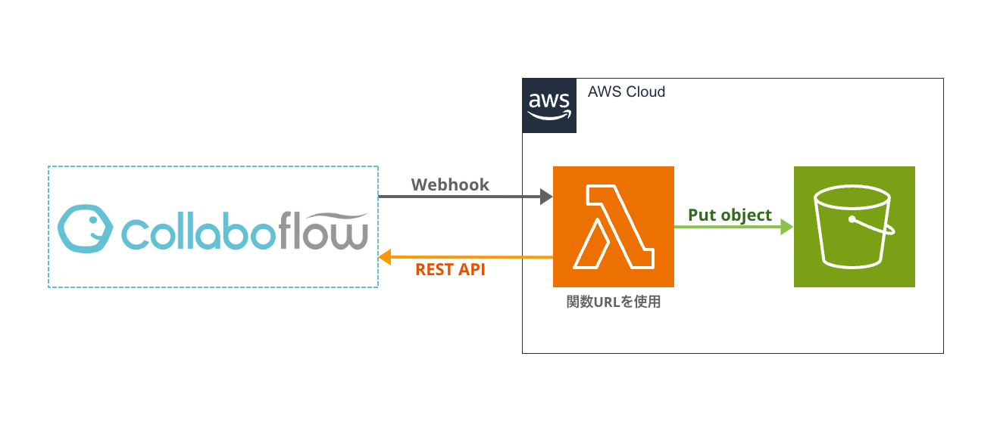

# Collaboflow File Backup Lambda

コラボフロー Webhook を起点に添付ファイルを Amazon S3 にバックアップとして保存する AWS Lambda 関数

<div align="center">
  
</div>

## Deploy

ビルド後、関数 URL を有効にしてデプロイします。

```shell
cargo lambda build --release
cargo lambda deploy --enable-function-url
```

## Setting up

Lambda 関数をデプロイ後、コラボフローで以下の設定をおこなう。

1. フォームを作成する
2. 添付ファイルパーツのパーツ ID を `fidFile` とする
3. 経路を作成する
4. 経路設定から Webhook に Lambda 関数 URL を登録する
5. 「申請書の経路終了時に通知する」を有効にする

## LICENSE

This project is licensed under the [MIT license](LICENSE).
